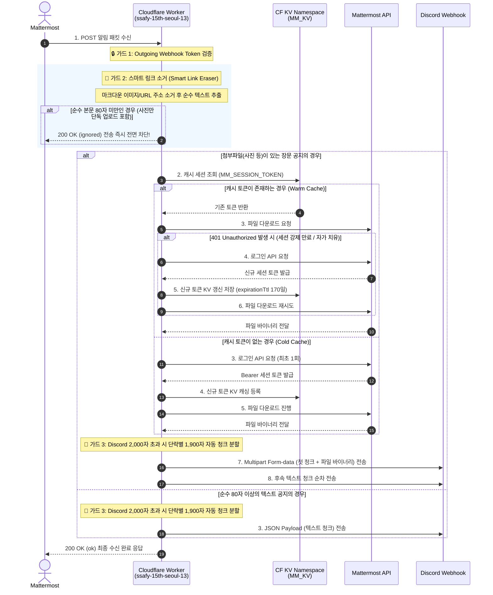

# ssafy-discord-worker

Cloudflare Worker based Discord automation code for two separate workflows:

- `discord-mail-cs`: sends the next frontend/backend mail content to Discord on a schedule
- `discord-mm-integration`: relays Mattermost messages and attachments to Discord using a single JSON secret

## Repository Layout

```text
.
├── discord-mail-cs/
│   ├── mail-cs.js
│   ├── wrangler.jsonc
│   └── .dev.vars.example
├── discord-mm-integration/
│   ├── integration.js
│   ├── config.example.json
│   └── .dev.vars.example
└── .gitignore
```

## Security Rules

- Do not commit real webhook URLs, passwords, or Mattermost source tokens.
- Keep local secrets in ignored files such as `.dev.vars` or `discord-mm-integration/config.json`.
- Start from the example files in this repository and replace placeholder values locally.

## `discord-mail-cs`

This worker posts the next content item from the Maeil Mail repository to Discord.

### Required secrets

Copy `discord-mail-cs/.dev.vars.example` to `discord-mail-cs/.dev.vars` and replace the placeholders.

Required variables:

- `DISCORD_WEBHOOK_FRONTEND`
- `DISCORD_WEBHOOK_BACKEND`

The KV namespace binding name is `MAEIL_KV`, and the worker entry file is `mail-cs.js`.

### Local usage example

```bash
cd discord-mail-cs
cp .dev.vars.example .dev.vars
# fill in real webhook URLs
```

Then run the worker with your normal Wrangler workflow.

## `discord-mm-integration`

This worker receives Mattermost webhook payloads and forwards them to Discord.

### Required secret

The runtime expects a single environment variable:

- `MM_CONFIG`: JSON string containing Discord webhooks, source token mapping, and Mattermost login settings

### Prepare local config

1. Copy `discord-mm-integration/config.example.json` to `discord-mm-integration/config.json`
2. Replace all placeholder values with real values
3. Copy `discord-mm-integration/.dev.vars.example` to `discord-mm-integration/.dev.vars`
4. Convert the JSON to a single-line string and set it as `MM_CONFIG`

Example using `jq`:

```bash
cd discord-mm-integration
cp config.example.json config.json
cp .dev.vars.example .dev.vars
jq -c . config.json
```

Paste the `jq -c` output into the `MM_CONFIG=` line in `.dev.vars`.

If you deploy with Wrangler secrets instead of `.dev.vars`, store the same single-line JSON as the `MM_CONFIG` secret.

## Git-safe workflow

- Real secrets stay local only.
- Example files are committed.
- `.omx/`, `.dev.vars`, `.env*`, logs, and `discord-mm-integration/config.json` are ignored by Git.

## Initial Git setup

```bash
git init
git branch -M main
git remote add origin https://github.com/rlagkswn00/ssafy-discord-worker.git
```

After secret values are confirmed to be excluded, commit and push `main`.

---

## 🌐 `discord-mm-integration` 고도화 아키텍처 명세서 (2026-05)

SSAFY Mattermost ↔ Discord 브릿지 모듈은 **Cloudflare Workers 서버리스 인프라**를 기반으로 작동하며, 대규모 트래픽 유입에 대응하고 불필요한 노이즈를 철저히 차단하는 실무형 지능화 아키텍처로 고도화되었습니다.

### 📌 1. 전체 데이터 플로우 (Sequence Diagram)



### 📌 2. 3대 핵심 아키텍처적 고도화 성과 (Key Breakthroughs)

#### **① 180일 유효 세션 KV 캐싱 및 자가 치유 (Self-Healing Cache)**
* **비효율 개선**: 첨부파일 유입 시마다 Mattermost 로그인 API를 실시간 호출하던 구조를 완전히 혁신.
* **영속 캐시**: 180일 세션 기한을 간파, 최초 로그인 성공 토큰을 Cloudflare KV(`env.MM_KV`)에 보관하여 재사용함으로써 **네트워크 로그인 RTT를 제거**하고 전송 딜레이를 소멸시켰습니다.
* **자가 치유**: 180일 도중 세션이 강제 폭파되거나 만료되어 `401 Unauthorized` 에러가 감지되면, **스스로 이를 감지하여 즉시 재로그인 후 KV 저장소의 만료 열쇠를 자동으로 갈아 끼워 회복**해 냅니다.

#### **② 지능형 노이즈 가드: 스마트 링크 소거 (Smart Link Eraser)**
* **문제 해결**: 사진만 올리더라도 마터모스트가 본문에 강제 삽입하는 약 100자 상당의 이미지 링크 마크다운 문자열을 정규식으로 흔적 없이 소거하도록 필터를 고도화.
* **결과**: 사용자가 글자 없이 **사진만 단독 업로드한 게시물은 순수 글자수가 `0`자로 정밀 측정되어 80자 미만 조건문 가드에 걸려 즉시 차단(ignored)**됩니다. (짤방 및 의미 없는 이미지 포스팅 완벽 원천 봉쇄)

#### **③ 안전한 내부 에러 캡슐화 (Error Encapsulation)**
* **보안 강화**: 예외 발생 시 디테일한 stack trace가 외부 API 응답으로 평문 노출되는 취약점을 철저히 격리.
* **결과**: 세부 분석용 에러 로그는 **Cloudflare 런타임 콘솔에만 안전하게 보관**하고, 외부 연동 기기에는 암호화 정형화된 JSON 메시지(`{"success":false,"error":"Internal Server Error"}`)만 안전하게 리턴합니다.

